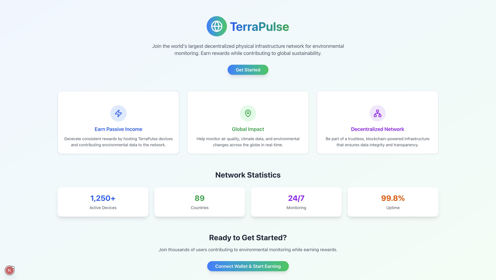

## TerraPulse (DePIN Project)

<div align="center">
 
</div>

> Decentralized environmental monitoring & rewards platform

### Project Highlights

- **Pitch Deck**: [Slides](https://www.canva.com/design/DAG18ZEog-s/RFQ8r3C1jb5x7OyA_eXG-A/edit?utm_content=DAG18ZEog-s&utm_campaign=designshare&utm_medium=link2&utm_source=sharebutton)
- **Devnet Address**: [EeLVcxJ4sG9Gj5bqsKbUG25KMsGrLSWcauKQwBUpCWRh](https://explorer.solana.com/address/EeLVcxJ4sG9Gj5bqsKbUG25KMsGrLSWcauKQwBUpCWRh?cluster=devnet)
- **Program Repository**: [Program](https://github.com/solana-turbin3/TerraPulse-DePIN/tree/main/anchor)
- **Embedded Repository(Esp32)**: [Embedded](https://github.com/solana-turbin3/TerraPulse-DePIN/tree/main/esp32)
- **Frontend Repository**: [Frontend](https://github.com/solana-turbin3/TerraPulse-DePIN/tree/main/src)
- **Backend Repository**: [Backend](https://github.com/solana-turbin3/TerraPulse-DePIN/tree/main/src/app/api)

---

## Project Description

TerraPulse is an on-chain-enabled network for environmental monitoring. It allows operators to host ESP32-based devices that collect environmental data (temperature, humidity, etc.) and post validated readings to the backend. Users earn on-chain rewards for validated contributions; rewards are synchronized on-chain using an Anchor program.

This repo implements three components:

1. Embedded (ESP32) — sensor code (DHT11), scheduling, WiFi provisioning via WiFiManager, and POST to backend API.
2. Frontend & Backend — Next.js app with pages for authentication, dashboard, claim flow, and server API routes to accept device data, manage devices/sensors, and sync rewards to the blockchain.
3. Anchor Program — simple reward accounting: initialize, initialize_user (per-user config), update_points (admin-driven), and claim (mint reward tokens to users).

---

## Embedded (ESP32)

Path: `esp32/`

- Firmware reads DHT sensor on `GPIO 26`, calculates quality scores, and sends JSON to the backend.
- Edit `esp32/src/main.cpp`: set `serverUrl` to your machine's LAN IP (e.g. `http://193.162.1.100:3000/api/data`) and configure `PUBLIC_KEY_BASE58` if needed.
- Build/flash with PlatformIO.

Quick flash (PlatformIO):

```bash
cd esp32
platformio run --target upload -e esp32dev
```

---

## Frontend & Backend (Next.js)

Path: `src/` and root-level scripts in `package.json`.

Notable pages (UI):

- `src/app/page.tsx` — Landing page + login trigger
- `src/app/home/page.tsx` — Authenticated dashboard (tokens, devices, stats)
- `src/app/claim/page.tsx` — Claim rewards UI
- `src/app/register/page.tsx` — Device registration/apply UI

Important API routes (server endpoints used by device and UI):

- `src/app/api/sensor-data/route.ts` — simple device POST endpoint for temperature/humidity (ESP32 example uses this). Creates/updates device & sensors and stores readings.
- `src/app/api/sensor-readings/route.ts` — main readings endpoint with filtering, validation, and optional IPFS/on-chain proof support.
- `src/app/api/sensors/route.ts` — create/list sensors for devices.
- `src/app/api/devices/route.ts` & `src/app/api/devices/[id]/route.ts` — devices list and detail endpoints.
- `src/app/api/users/route.ts` — user lookup/create; on new user creation it calls the Anchor `initialize_user` instruction.
- `src/app/api/sync/route.ts` — sync worker that aggregates unsynced points and calls `update_points` on-chain using an admin keypair.
- `src/app/api/rewards/*` — endpoints to manage points ledger and reward claims.

Local dev:

```bash
npm install
npm run dev
# visit http://localhost:3000
```

---

## Anchor Program (Rewards)

Path: `anchor/programs/counter/`

Declared program ID: `EeLVcxJ4sG9Gj5bqsKbUG25KMsGrLSWcauKQwBUpCWRh`.

Instructions (what they do):

- `initialize(reward_temp, reward_noise, reward_vibration, reward_heat)`
  - Admin-only. Creates the `Config` account (PDA with seed `config`) and a `rewards` mint for on-chain token issuance.
  - Stores per-sensor reward multipliers and bumps.

- `initialize_user(user_key: Pubkey)`
  - Admin-only. Creates a user-specific `UserConfig` PDA (seed `user` + user pubkey) that tracks per-sensor accumulated point counters.

- `update_points(sensor_type: SensorType, value: u32)`
  - Admin-only. Increments the appropriate per-user point counter on `UserConfig` (SensorType enum: Noise, Temp, Vibration, Heat).
  - Intended to be called by the backend `sync` worker which aggregates unsynced points from the DB and pushes totals on-chain.

- `claim()`
  - User-signed. Calculates total tokens to mint using stored multipliers, mints reward tokens to the user's associated token account, and zeros the counters on `UserConfig`.

State & Account structs (summary):

- `Config` (PDA `config`)
  - admin: Pubkey
  - rewards_bump: u8
  - reward_temp/noise/vibration/heat: u8 (multipliers)
  - bump: u8

- `UserConfig` (PDA `user` + user pubkey)
  - user: Pubkey
  - temp_points/noise_points/vibration_points/heat_points: u32
  - bump: u8

---

## Quick commands & dev notes

- Install JS deps: `npm install`
- Start Next dev: `npm run dev`
- Anchor localnet: `npm run anchor-localnet` (or `cd anchor && anchor localnet`)
- Anchor build: `npm run anchor-build`
- Flash ESP32: `platformio run --target upload -e esp32dev` from `esp32/`

Notes and cautions:

- The backend `sync` job requires an admin keypair for on-chain updates. Provide `SECRET_KEY` (bs58) env or keep the keypair in `anchor/target/deploy/` when testing locally — don't commit private keys.
- ESP32: update `serverUrl` in `esp32/src/main.cpp` before flashing so the device can reach your dev server.
